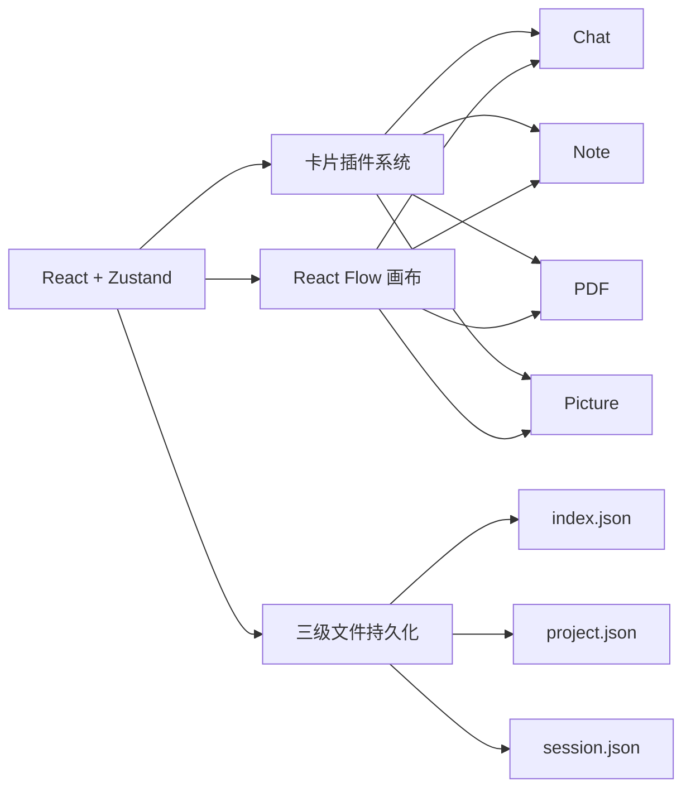

# Chat Canvas

> 画布式 AI 对话工具 -- 把聊天变成一张可连线、可分支的有向图

---

## 这是什么

Chat Canvas 不是普通聊天页。它把每个聊天单元做成一张**卡片**，卡片之间可以**连线**，形成一张有向图。你可以在画布上自由拖拽、连线、分叉对话，像搭积木一样组织 AI 交互。

每种卡片是一个独立的知识单元：

| 卡片 | 能力 |
|---|---|
| Chat | 多轮对话、流式输出、分支追问、多模态输入 |
| Note | Markdown 笔记，支持 GFM / 数学公式 / 代码高亮 |
| PDF | 上传 PDF，`pdf.js` 渲染，哈希去重存储 |
| Picture | 上传图片，内容哈希命名，去重引用 |

---

## 核心架构



### 三级文件持久化

不是一个大 JSON blob，而是分层落盘：

```
chat-canvas-data/
  index.json          # 项目列表 + 当前激活项目
  schema/             # JSON Schema 权威格式定义
  projects/
    <pid>/
      project.json    # Session 列表 + 资源索引
      assets/         # PDF / 图片二进制 (SHA-256 命名)
      sessions/
        <sid>.json    # 完整图数据: 节点 + 边 + 视口 + 消息
```

### 卡片插件化

所有卡片通过统一注册表接入，新增卡片类型无需全项目改 `if-else`。每种卡片声明自己的默认字段、渲染组件、上下文输出方式、搜索参与方式。

### 上下文构建

对话的上下文不是简单的"全文复制"，而是：
1. 沿 `inherit` 边 BFS 收集上游
2. 每个上游节点调用自己的结构化 `output()`
3. 目标卡片调用自己的 `input()` 消费
4. 注入全局 / 卡片级 system prompt

---

## 运行模式

| 模式 | 命令 | 存储后端 |
|---|---|---|
| 浏览器开发 | `npm run dev` | Vite dev server 中间件 |
| Electron 开发 | `npm run dev:electron` | 主进程本地文件系统 |
| 浏览器构建 | `npm run build` | 无文件后端 (回退空画布) |
| Electron 打包 | `npm run package` | 本地文件系统 |

启动时自动探测可用后端，优先级：远程服务 > Electron IPC > dev server > 抛错回退。

---

## 快速开始

```bash
# 安装依赖
npm install

# 浏览器开发模式
npm run dev

# Electron 桌面开发模式
npm run dev:electron

# 类型检查
npm run typecheck

# 数据一致性校验 (外部改文件后手动触发)
npm run check-data
```

### 打包

```bash
# Windows
npm run package:win

# macOS
npm run package:mac

# Linux
npm run package:linux
```

---

## 技术栈

| 层面 | 技术 |
|---|---|
| 框架 | React 18 + TypeScript |
| 状态管理 | Zustand |
| 画布 | @xyflow/react (React Flow) |
| 桌面壳 | Electron 32 + electron-vite |
| 样式 | Tailwind CSS |
| Markdown | react-markdown + remark-gfm + rehype-mathjax |
| PDF 渲染 | pdfjs-dist |
| 代码高亮 | highlight.js |
| 文件监听 | chokidar |

---

## 项目结构

```
src/
  types/            # 核心数据模型 (GraphNode, GraphEdge, SessionData...)
  store/            # Zustand 状态管理 + 启动引导 + 分层层管理器
    useCanvasStore   # 画布世界总管家: 节点/边/Session/Project/导入导出
    useChatStore     # 流式消息状态机
    useSettingsStore # 模型配置/主题/API Key
    bootstrap        # 启动序列: 适配器选择 -> 迁移 -> 校验 -> 加载
    sessionRuntime   # 激活 Session 防抖落盘
    projectManager   # project.json 管理
    rootManager      # index.json 管理
  cards/            # 卡片插件系统
    builtin/         # 内置插件: chat, note, pdf, picture
    registry         # 插件注册表
    communicateAdapter # 上下文构建适配
  components/       # UI 组件
    Canvas/          # React Flow 画布交互
    ChatNode/        # 最复杂的卡片: 流式对话/分叉/追问
    NoteNode/        # Markdown 编辑器
    PdfNode/         # PDF 查看器
    PictureNode/     # 图片查看器
    Settings/        # 设置对话框
  lib/              # 工具库
    storage/         # 持久化核心: 协议/路径/适配器/一致性/迁移
    llm              # LLM 调用 + 流式解析 + 请求锁
    contextBuilder   # 上下文构建引擎
    resourceIndex    # 资源引用索引
    sessionBundle    # 导入导出 Bundle
  hooks/            # React hooks
electron/           # Electron 主进程 / preload / IPC / 菜单
scripts/            # CLI 工具 (数据校验)
docs/               # 设计文档
```

---

## 工程亮点

- **三级文件持久化**：index -> project -> session 逐层分离，按需加载，独立防抖落盘
- **一致性自愈**：启动校验 + 文件监听 + CLI 工具三道防线，外部改文件不损坏数据
- **资源索引去重**：SHA-256 内容哈希命名，节点自报引用 + 项目级索引，删除时精确清理
- **卡片插件化**：注册式架构，新增卡片类型零侵入
- **激活 Session 单实例权威**：内存唯一状态，非激活以磁盘为准，避免双副本同步
- **并发控制**：防抖 + 串行后台队列 + Promise 请求锁

---

## 存储协议

持久化层遵循统一的 HTTP 消息服务协议 (v2)，详见 [docs/store-protocol.md](docs/store-protocol.md)。核心设计：

- 渲染层通过 `StorageAdapter` 接口访问持久化，不直接碰文件系统
- `ElectronFsAdapter` 与 `DevServerAdapter` 共享同一接口
- SSE 推送外部变更通知，多写者场景自动收敛
- 统一错误格式 `{ error, code }`，路径防穿越

---

## 源码导读

如果你是第一次看这个项目，建议按以下顺序阅读 (详见 [docs/source-guide.md](docs/source-guide.md))：

1. `src/types/index.ts` -- 数据结构
2. `src/main.tsx` / `src/App.tsx` -- 入口
3. `src/store/bootstrap.ts` -- 启动流程
4. `src/store/useCanvasStore.ts` -- 核心状态
5. `src/store/sessionRuntime.ts` -- 落盘机制
6. `src/lib/storage/consistency.ts` -- 自愈逻辑
7. `src/cards/` -- 插件系统
8. `electron/` -- 桌面桥接

---

## License

MIT License
