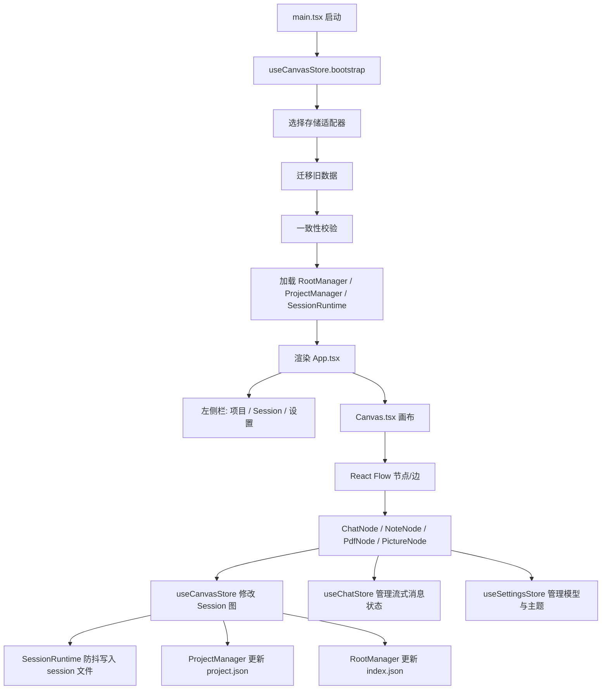

# Chat Canvas 源码导读

这份文档是给“会一点 TypeScript 基础语法，但不熟悉 Electron、文件持久化、监听、并发控制、流式网络请求”的读者准备的。

目标不是让你背 API，而是让你在看完后：

1. 知道这个项目的核心架构是什么
2. 知道主要功能分别落在哪些文件
3. 知道数据是怎么流动、怎么落盘、怎么恢复的
4. 知道这个项目工程上做得好的地方和目前还需要警惕的地方
5. 遇到常见 bug 时，知道先看哪里

---

## 1. 先用一句话理解项目

这是一个基于 `React + Zustand + React Flow + Electron` 的“画布式 AI 对话工具”。

它不是普通聊天页，而是把每个聊天单元做成一张卡片，卡片之间可以连线，形成一个有向图。  
每个卡片可能是：

- 对话卡片 `chat`
- 笔记卡片 `note`
- PDF 卡片 `pdf`
- 图片卡片 `picture`

它的核心设计不是“页面状态”，而是“项目 -> Session -> 节点图 + 文件资源”。

---

## 2. 你先建立这张脑图



如果你先把上面这张图记住，后面大部分代码都会变得好理解。

---

## 3. 这个项目最重要的 10 个文件

建议你先看这些文件，优先级从高到低：

1. [`src/types/index.ts`](../src/types/index.ts)  
   所有核心数据结构都在这里。先读它，后面才知道每个模块在处理什么。

2. [`src/store/useCanvasStore.ts`](../src/store/useCanvasStore.ts)  
   这是项目主状态中心，负责节点、边、项目、Session、导入导出、资源索引。

3. [`src/store/sessionRuntime.ts`](../src/store/sessionRuntime.ts)  
   理解“为什么只有激活 Session 驻留内存、其他 Session 只保留磁盘权威”。

4. [`src/store/bootstrap.ts`](../src/store/bootstrap.ts)  
   应用启动到底做了哪些事，全在这里。

5. [`src/store/projectManager.ts`](../src/store/projectManager.ts)  
   理解项目内的 `project.json`、`sessionIds`、`assetIndex`。

6. [`src/components/Canvas/Canvas.tsx`](../src/components/Canvas/Canvas.tsx)  
   理解 React Flow 交互、连线、右键菜单、拖拽、复制粘贴。

7. [`src/components/ChatNode/ChatNode.tsx`](../src/components/ChatNode/ChatNode.tsx)  
   理解最复杂的 UI 卡片：流式对话、多模态、分叉、追问、系统提示。

8. [`src/cards/communicateAdapter.ts`](../src/cards/communicateAdapter.ts)  
   理解“上游卡片内容如何变成当前卡片的上下文”。

9. [`src/lib/storage/consistency.ts`](../src/lib/storage/consistency.ts)  
   理解为什么这个项目不容易因为外部改文件就坏掉。

10. [`electron/main.ts`](../electron/main.ts) + [`electron/preload.ts`](../electron/preload.ts)  
   理解 Electron 版是怎么把“前端”接到“本地文件系统”的。

---

## 4. 先懂数据模型，不然会越看越乱

核心类型在 [`src/types/index.ts`](../src/types/index.ts)。

### 4.1 GraphNode

每张卡片都是一个 `GraphNode`。

关键字段：

- `id`: 节点 id
- `type`: `chat | note | pdf | picture`
- `position`: 画布位置
- `title`: 卡片标题
- `messages`: 聊天消息数组
- `markdownContent`: note 内容
- `pdfPath`: PDF 文件相对路径
- `picturePath`: 图片相对路径
- `resourceRefs`: 该节点引用了哪些资源

### 4.2 GraphEdge

边表示卡片之间的关系。

- `inherit`: 继承上下文的主连线
- `reference`: 引用型连线

### 4.3 SessionData

一个 Session 本质上就是一张完整的有向图快照：

- `nodes`
- `edges`
- `viewport`

### 4.4 ProjectData

Project 是 Session 的容器。

你可以把它理解成“工作区”。

### 4.5 资源索引

这部分很关键：

- 节点自己记录 `resourceRefs`
- 项目级 `project.json` 记录 `assetIndex`

这意味着项目已经不是“靠删卡片时现场猜测资源引用”，而是采用“节点自报引用 + 项目统一建索引”的方式做资源管理。

---

## 5. 这个项目的持久化不是 localStorage，而是三级文件系统

路径工具定义在 [`src/lib/storage/paths.ts`](../src/lib/storage/paths.ts)。

目录结构大致是：

```text
chat-canvas-data/
  index.json
  schema/
  projects/
    <projectId>/
      project.json
      sessions/
        <sessionId>.json
      assets/
        <sha256>.pdf
        <sha256>.png
```

### 5.1 `index.json`

由 [`src/store/rootManager.ts`](../src/store/rootManager.ts) 管理。

它只负责：

- 有哪些项目
- 当前激活项目是谁

### 5.2 `project.json`

由 [`src/store/projectManager.ts`](../src/store/projectManager.ts) 管理。

它只负责：

- 这个项目有哪些 Session
- 当前激活 Session 是谁
- Session 的轻量元信息
- 项目级资源索引 `assetIndex`

### 5.3 `sessions/<sid>.json`

由 [`src/store/sessionRuntime.ts`](../src/store/sessionRuntime.ts) 负责写入。

它存储完整图数据：

- 节点
- 边
- 视口
- 消息

### 5.4 为什么这样分层

这是这个项目工程上最对的一点之一。

好处：

1. 不必把所有 Session 一次性读进内存
2. Session 可以单独防抖落盘
3. 项目列表展示时只读 `project.json` 即可
4. 出问题时更容易自愈

这比“整个应用一个巨大的 JSON blob”稳很多。

---

## 6. 启动流程怎么走

启动入口在 [`src/main.tsx`](../src/main.tsx)。

它只做两件事：

1. 调 `useCanvasStore.getState().bootstrap()`
2. 再挂载 React 应用

真正的启动序列在 [`src/store/bootstrap.ts`](../src/store/bootstrap.ts)。

步骤是：

1. 选择存储适配器
2. 把旧数据迁移过来
3. 写入 schema 文件
4. 执行一致性校验
5. 读取 `index.json`
6. 找到当前激活项目和激活 Session
7. 只加载激活 Session 的完整内容
8. 其他 Session 只做成 stub 放进内存

### 6.1 什么是 stub

stub 就是一个“只保留元信息，不加载完整内容”的 Session 占位对象。

这样做的目的：

- 左侧栏能显示 Session 列表
- 但不会把所有大图、大消息、大图结构全塞进内存

这个设计对性能很重要。

---

## 7. 三个 Store 各干什么

### 7.1 `useCanvasStore`

文件：[`src/store/useCanvasStore.ts`](../src/store/useCanvasStore.ts)

这是项目最核心的 store。

它负责：

- 节点增删改查
- 边增删改查
- 视口同步
- 撤销重做
- Session 创建、切换、复制、删除、移动
- Project 创建、切换、删除
- 导入导出 bundle
- 资源索引同步
- 外部文件变更后的收敛

你可以把它理解为：

“画布世界的总管家”。

### 7.2 `useChatStore`

文件：[`src/store/useChatStore.ts`](../src/store/useChatStore.ts)

它不是“消息数据库”，而是“流式消息状态机”。

真正的消息还是存回 `GraphNode.messages`。

它负责：

- 插入 user message
- 插入 assistant 占位消息
- 按 token 追加流式输出
- 完成 / 错误状态切换

这是一种很常见的工程拆分：

- 持久内容归总 store
- 短生命周期流式状态归专门 store

### 7.3 `useSettingsStore`

文件：[`src/store/useSettingsStore.ts`](../src/store/useSettingsStore.ts)

负责：

- 服务商配置
- 默认模型
- 主题
- 上下文策略
- 全局 system prompt
- 侧边栏缩放

它还通过 `secureSet` 把 API Key 存到 Electron 安全存储或浏览器降级存储。

---

## 8. 这个项目没有“真正的多线程锁”，但有 3 种并发控制

你提到自己对锁机制、多线程不熟。这里先说结论：

**这个项目的大部分代码仍然运行在 JavaScript 单线程事件循环里。**

真正复杂的不是“线程锁”，而是“异步任务并发下如何避免状态打架”。

这里用了 3 种方法：

### 8.1 防抖

在 [`src/store/sessionRuntime.ts`](../src/store/sessionRuntime.ts) 里，Session 内容变化不会每次立刻写盘，而是防抖 500ms。

这能避免：

- 拖动节点时疯狂写文件
- 输入时频繁写盘

### 8.2 串行后台队列

在 [`src/store/useCanvasStore.ts`](../src/store/useCanvasStore.ts) 里有 `bgQueue`。

它把后台落盘任务串起来执行，避免顺序错乱，比如：

- 先创建 Session
- 再登记 Session

如果顺序反了，磁盘状态可能会短暂不一致。

### 8.3 Promise 锁

在 [`src/lib/llm.ts`](../src/lib/llm.ts) 里有 `locks`。

它不是操作系统锁，而是“同域名请求串行锁”。

作用：

- 同一个 AI 提供商的请求不要同时猛发
- 减少 429

这是前端常见的“逻辑锁”，不是线程锁。

---

## 9. 卡片系统是插件化的，这是这个项目另一个很好的工程点

相关文件：

- [`src/cards/types.ts`](../src/cards/types.ts)
- [`src/cards/registry.ts`](../src/cards/registry.ts)
- [`src/cards/builtin/register.ts`](../src/cards/builtin/register.ts)

每种卡片都是一个 `CardPlugin`。

插件描述了：

- 类型
- 标签
- 默认字段
- 是否允许同层连线
- React 组件
- 如何输出上下文
- 如何参与搜索
- 如何导出内容

这意味着新增卡片类型时，不需要去全项目到处改 `if (type === ...)`。

### 已有插件

- `chatCard.plugin.ts`
- `noteCard.plugin.ts`
- `pdfCard.plugin.ts`
- `pictureCard.plugin.ts`

### 为什么这很重要

因为这让“业务类型扩展”从硬编码切到了注册式架构。

对长期维护非常有帮助。

---

## 10. 上下文构建到底怎么做

很多人第一次看这种项目，最容易卡在：

“一张卡片向 AI 发请求时，上游卡片内容到底怎么拼进去？”

答案在：

- [`src/cards/communicateAdapter.ts`](../src/cards/communicateAdapter.ts)
- [`src/lib/contextBuilder.ts`](../src/lib/contextBuilder.ts)

### 10.1 过程

1. 从当前目标卡片开始
2. 沿 `inherit` 边向上 BFS 收集上游
3. 同层链可折叠
4. 每个上游节点调用自己插件的 `output()`
5. 目标卡片调用自己的 `input()` 把这些包转换成 `ChatMessage[]`
6. 再注入全局/卡片级 system prompt

### 10.2 这意味着什么

这个项目不是简单的“把父节点全文复制给子节点”。

而是：

- 先结构化输出
- 再由目标类型决定如何消费

这是一种更工程化的做法。

---

## 11. 4 种卡片分别怎么实现

### 11.1 Chat 卡片

文件：[`src/components/ChatNode/ChatNode.tsx`](../src/components/ChatNode/ChatNode.tsx)

这是最复杂的卡片。

它负责：

- 文本输入
- 图片输入（当前是发给模型，不进入项目资源系统）
- 流式输出
- 编辑历史消息
- 从某条消息分叉
- 选中术语后创建追问分支
- 卡片级 system prompt

你看这个文件时，不要试图一次读完。建议按功能块看：

1. 发送流程
2. 消息编辑
3. 图片输入
4. 分叉/追问
5. 渲染

### 11.2 Note 卡片

文件：[`src/components/NoteNode/NoteNode.tsx`](../src/components/NoteNode/NoteNode.tsx)

它是 Markdown 笔记卡。

特点：

- 左侧编辑 / 右侧预览
- 支持 GFM、数学公式、代码高亮
- 支持导入 `.md`
- 失焦或 `Ctrl+S` 保存

注意：当前 note 已经不再承载图片资源上传职责。

### 11.3 PDF 卡片

文件：[`src/components/PdfNode/PdfNode.tsx`](../src/components/PdfNode/PdfNode.tsx)

流程是：

1. 上传 PDF
2. 计算 SHA-256
3. 写入 `assets/`
4. 节点只保存 `pdfPath`
5. 读取二进制
6. 生成 `blobUrl`
7. 交给 `pdf.js` 渲染到 canvas

这比用 iframe 更可控，也更工程化。

### 11.4 Picture 卡片

文件：[`src/components/PictureNode/PictureNode.tsx`](../src/components/PictureNode/PictureNode.tsx)

流程与 PDF 类似：

1. 上传图片
2. 哈希命名
3. 写入 `assets/`
4. 节点只保存 `picturePath`
5. 读取为 blob URL
6. 用 `` 显示

---

## 12. 资源管理是怎么做的

相关文件：

- [`src/lib/resourceIndex.ts`](../src/lib/resourceIndex.ts)
- [`src/store/projectManager.ts`](../src/store/projectManager.ts)
- [`src/store/useCanvasStore.ts`](../src/store/useCanvasStore.ts)

### 12.1 核心思想

资源文件不靠“文件名推测”，而靠“引用索引”。

两层：

1. 节点自身 `resourceRefs`
2. 项目级 `assetIndex`

### 12.2 为什么这样稳

删除卡片时，不需要重新扫全世界猜谁用了这个 PDF/图片。

而是：

1. 找到这个节点登记过的资源
2. 从项目级索引里删掉这个节点对应的引用
3. 如果没有任何引用剩下，才删物理文件

### 12.3 去重机制

图片/PDF 都按内容哈希命名。

这意味着：

- 重名不同内容，不冲突
- 同内容不同卡片，可共用同一份文件

这是合理的。

---

## 13. 导入导出不是裸 Session，而是 Bundle

文件：[`src/lib/sessionBundle.ts`](../src/lib/sessionBundle.ts)

导出格式大致是：

```json
{
  "format": "chat-canvas-bundle",
  "version": 1,
  "sessions": {},
  "activeSessionId": "...",
  "assets": []
}
```

### 导出时做什么

1. 找到要导出的 Session
2. 收集它们引用的资源路径
3. 读取二进制
4. 转 base64
5. 打包成 JSON

### 导入时做什么

1. 识别 bundle
2. 给资源路径建立目标项目映射
3. 重写 Session 内资源路径
4. 做查重
5. 落资源
6. 写 Session
7. 更新资源索引

### 风险提醒

这种 bundle 设计功能完整，但有一个工程代价：

**大资源会导致 JSON 很大，内存峰值较高。**

这不是逻辑 bug，而是格式本身的代价。后续更优方案是 zip。

---

## 14. Electron 版到底比浏览器版多了什么

相关文件：

- [`electron/main.ts`](../electron/main.ts)
- [`electron/preload.ts`](../electron/preload.ts)
- [`electron/menu.ts`](../electron/menu.ts)
- [`src/lib/storage/electronFs.ts`](../src/lib/storage/electronFs.ts)

### 14.1 你要先知道：这不是 TypeScript 的特殊机制，而是 Electron 的进程模型

Electron 里至少有两个重要角色：

1. 主进程
2. 渲染进程

渲染进程就是 React 页面。  
它不能直接随便碰 Node 文件系统，所以要通过 `preload` 做桥接。

### 14.2 这条链怎么走

1. React 调 `window.electronAPI.storeRead(...)`
2. 这个函数来自 `preload.ts`
3. `preload.ts` 用 `ipcRenderer.invoke(...)`
4. 主进程 `electron/main.ts` 用 `ipcMain.handle(...)` 接住
5. 主进程调用文件系统实现

### 14.3 菜单事件怎么回来

1. 原生菜单点击
2. `menu.ts` 调 `webContents.send(...)`
3. `preload.ts` 注册监听
4. React 的 `App.tsx` / `Canvas.tsx` 收到回调

---

## 15. 一致性校验为什么很重要

文件：[`src/lib/storage/consistency.ts`](../src/lib/storage/consistency.ts)

这是这个项目抗脏数据能力的关键模块。

它处理的不是“正常功能”，而是“世界已经不干净了怎么办”。

比如：

- `index.json` 里有项目，但磁盘没这个目录
- `project.json` 里登记了 Session，但文件没了
- 磁盘里有 Session 文件，但没有登记
- 固定项目被删了
- `assetIndex` 过期了

它会做收敛和自愈。

这意味着这个项目已经在考虑：

- 外部手工改文件
- 旧版本迁移
- 文件丢失
- 索引失配

这是成熟工程里很重要的一步。

---

## 16. 这个项目工程性做得好的地方

下面这些，是我认为比较好的工程决策。

### 16.1 存储分层很清楚

- `RootManager` 只管 `index.json`
- `ProjectManager` 只管 `project.json`
- `SessionRuntime` 只管激活 Session

这是很好的职责划分。

### 16.2 激活 Session 单实例权威

激活 Session 在内存中只有一份权威状态。  
非激活 Session 以磁盘为准，不做长期双副本。

这减少了同步复杂度。

### 16.3 卡片插件化

避免了未来卡片类型变多时到处写分支判断。

### 16.4 有资源索引

资源生命周期管理已经不是拍脑袋删除。

### 16.5 有一致性校验

说明作者已经意识到“多写者 + 文件系统 + 手工改动”的脏状态问题。

---

## 17. 当前我看到的工程风险与技术债

这里我不粉饰，直接说实话。

### 17.1 `useCanvasStore.ts` 过大

这是当前最大的维护负担之一。

问题：

- 状态
- 业务
- 导入导出
- 资源同步
- 项目和 Session 操作

全压在一个 store 文件里。

短期能跑，长期会越来越难改。

建议未来拆成：

- node actions
- session actions
- project actions
- import/export actions
- resource actions

### 17.2 `ChatNode.tsx` 功能密度很高

它已经接近“超级组件”了。

建议未来拆出：

- message list
- input area
- branch tools
- prompt editor

### 17.3 Bundle 格式有内存峰值压力

大 PDF / 大图导出导入时，JSON + base64 不够经济。

### 17.4 有些 UI 组件仍存在“局部逻辑直接写 store”的紧耦合

这不是错，但会让组件越来越懂业务。

### 17.5 Note 卡片当前 resize 持久化不完整

[`src/components/NoteNode/NoteNode.tsx`](../src/components/NoteNode/NoteNode.tsx) 目前只有 `NodeResizer`，但没有像 `ChatNode` / `PdfNode` / `PictureNode` 那样在 `onResizeEnd` 里把 `width/height` 持久化回 store。  
这意味着 Note 卡片尺寸的持久化行为目前不统一，属于值得尽快补齐的一处工程不一致。

---

## 18. 常见 bug 和第一排查入口

这一节很重要。你以后出问题，不要全项目乱翻，先按这里找。

### 18.1 卡片改了但刷新后丢失

先看：

- [`src/store/sessionRuntime.ts`](../src/store/sessionRuntime.ts)
- [`src/store/useCanvasStore.ts`](../src/store/useCanvasStore.ts)

重点排查：

- 是否真正调用了 `updateNode`
- 是否写进了 `runtime.session`
- 是否被 `flush()` 写盘
- 是否只是本地 React 状态改了，没有回 store

### 18.2 切换 Session 后内容异常

先看：

- `switchSession`
- `loadFullSession`
- `activateSession`
- `bootstrapCanvasStore`

这通常和 stub / 完整 Session 切换有关。

### 18.3 资源删除不干净或误删

先看：

- `buildNodeResourceRefs`
- `syncNodeResources`
- `removeSessionResources`
- `assetIndex`

先确认是“节点引用没建对”，还是“删除链路没同步索引”。

### 18.4 导入导出后路径错乱

先看：

- `sessionBundle.ts`
- `remapSessionBundleAssets`
- `importSessions`

这类问题通常不是显示层 bug，而是资源路径重写逻辑的问题。

### 18.5 Electron 下菜单点击触发多次

先看：

- `electron/preload.ts`
- `App.tsx`
- `Canvas.tsx`

这类问题几乎都和监听注册/退订有关。

### 18.6 流式回复卡死、重复、无法停止

先看：

- `ChatNode.handleSend`
- `useChatStore`
- `llm.ts`
- `mockStream.ts`

先判断是：

- UI 状态没切换
- Abort 没接住
- 流式解析没结束
- pending / streaming 状态机不一致

### 18.7 拖拽、缩放、输入时明显卡顿

先看：

- React 组件是否高频写 store
- 是否每次都深拷贝整个 Session
- 是否 object URL / FileReader / 大字符串在频繁重建
- React Flow 的节点是否在拖动时触发了不必要重渲染

---

## 19. 你要特别理解的 6 个 TypeScript/前端工程模式

如果你能把下面 6 个模式看懂，你基本就掌握这个项目 80% 的读法了。

### 19.1 Store 模式

Zustand store 是全局状态容器。  
读状态：`useXxxStore((s) => s.xxx)`  
改状态：调用 store action。

### 19.2 适配器模式

存储层通过统一接口 `StorageAdapter` 抽象：

- Electron
- dev server
- 未来远程服务

上层不关心底下到底是谁。

### 19.3 Manager 分层

这是对文件边界的对象化封装：

- RootManager
- ProjectManager
- SessionRuntime

### 19.4 插件注册模式

卡片类型通过注册表统一接入，而不是写死在大分支里。

### 19.5 监听与 cleanup

任何 `addEventListener`、`ipcRenderer.on`、`createObjectURL`，都要思考清理。

这是前端稳定性的关键之一。

### 19.6 防抖与串行化

高频动作不能直接落盘，要通过：

- debounce
- promise queue
- 逻辑锁

控制副作用顺序。

---

## 20. 我建议你的源码阅读顺序

如果你真的想在短时间内掌握 90%，建议按这个顺序读：

### 第一轮：只建立结构感

1. `src/types/index.ts`
2. `src/main.tsx`
3. `src/App.tsx`
4. `src/store/bootstrap.ts`
5. `src/store/useCanvasStore.ts`

目标：知道系统有哪几层。

### 第二轮：看持久化和资源

1. `sessionRuntime.ts`
2. `rootManager.ts`
3. `projectManager.ts`
4. `resourceIndex.ts`
5. `sessionBundle.ts`
6. `consistency.ts`

目标：知道数据怎么存、怎么删、怎么自愈。

### 第三轮：看交互

1. `Canvas.tsx`
2. `ChatNode.tsx`
3. `NoteNode.tsx`
4. `PdfNode.tsx`
5. `PictureNode.tsx`

目标：知道 UI 怎么驱动 store。

### 第四轮：看扩展机制

1. `cards/types.ts`
2. `registry.ts`
3. `communicateAdapter.ts`
4. 各种 `*.plugin.ts`

目标：知道以后怎么加新卡片。

### 第五轮：看 Electron

1. `electron/main.ts`
2. `electron/preload.ts`
3. `electron/menu.ts`
4. `electronFs.ts`

目标：知道桌面版和浏览器版差在哪。

---

## 21. 最后给你的“项目真相版总结”

如果要非常直接地说：

### 这个项目已经具备的成熟度

- 架构不是玩具级
- 有明确的文件分层
- 有资源索引
- 有导入导出 bundle
- 有一致性校验
- 有 Electron 桥接
- 有卡片插件化扩展能力

### 这个项目目前的主要维护压力

- `useCanvasStore.ts` 太重
- `ChatNode.tsx` 太重
- bundle 的大资源场景还不够优雅
- 个别卡片实现细节存在不统一

### 是否只是“为了完成功能而忽略工程性”

**不是。**

这套代码明显已经有工程化意识，而且不少地方做得比普通功能型原型要好。

但它也确实还没有完全走到“高度模块化、低认知负担”的阶段。  
换句话说：

- 底层设计方向是对的
- 但上层文件组织还有继续整理空间

---

## 22. 你接下来最值得继续做的两件事

1. 把 `useCanvasStore.ts` 按职责拆分  
2. 给关键链路补“运行时排查手册”和“测试清单”

如果你只做这两件事，这个项目后续维护体验会明显提升。

